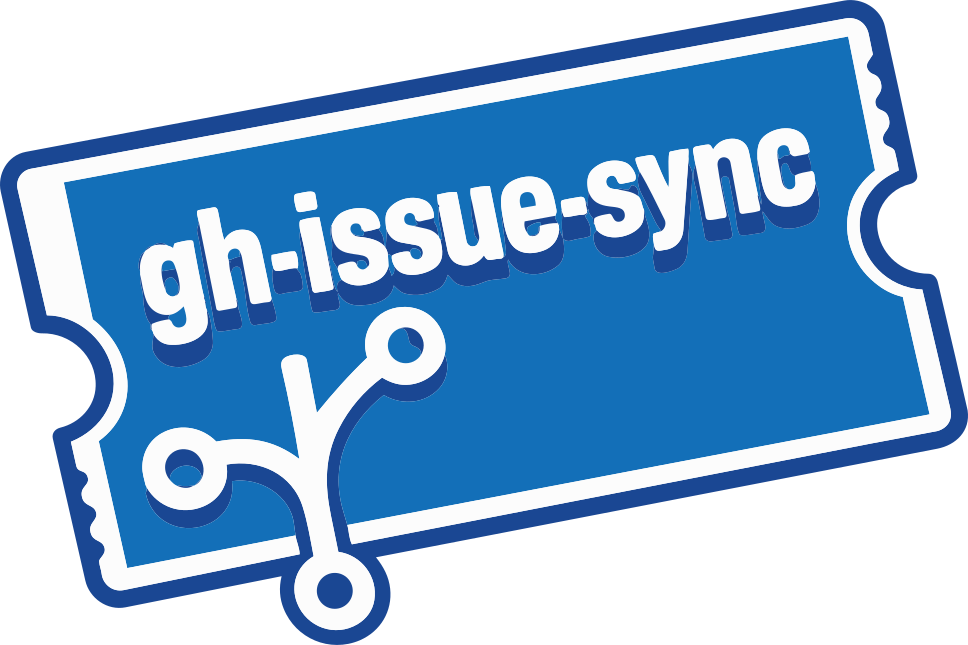

<div align="center">
  
  <p><strong>gh-issue-sync: sync GitHub issues locally and back</strong></p>
</div>

`gh-issue-sync` is a command line tool that syncs GitHub issues to local
Markdown files for offline editing, batch updates, and integration with
coding agents.

Pull issues locally, refine them until you are satisfied, and sync changes
back. Also useful for offline access to your issues.

## Why?

When refining many issues at once, editing them on GitHub can be tedious.
It is easier to make changes locally and push them all at once. This is
particularly useful when using Claude Code or similar tools to refine
issues iteratively.

Agents can work with issues locally until you are ready to push. The tool
also supports creating new issues locally with temporary IDs that get
replaced with real issue numbers after pushing.

<div align="center">
  <a href="https://www.youtube.com/watch?v=ClTvgE-sFls">
    
  </a>
  <p><em>Watch the demo video</em></p>
</div>

## Overview

`gh-issue-sync` mirrors GitHub issues into a local `.issues/` directory as
Markdown files with YAML front matter.  Edit issues in your favorite editor,
create new issues locally, and push changes back to GitHub when ready.

## Installation

Prerequisites:

- [GitHub CLI (`gh`)](https://cli.github.com/) installed and authenticated (`gh auth login`)
- If you use Projects sync, refresh scopes with `gh auth refresh -s project`

### Quick Install (macOS/Linux)

```bash
curl -sSfL https://github.com/mitsuhiko/gh-issue-sync/releases/latest/download/install.sh | sh
```

### Install with Go

```bash
go install github.com/mitsuhiko/gh-issue-sync/cmd/gh-issue-sync@latest
```

### Download Binary

Download the latest binary from [GitHub Releases](https://github.com/mitsuhiko/gh-issue-sync/releases/latest) and place it in your PATH.

### Build from Source

```bash
git clone https://github.com/mitsuhiko/gh-issue-sync.git
cd gh-issue-sync
go build -o gh-issue-sync ./cmd/gh-issue-sync
mv gh-issue-sync ~/.local/bin/
```

## Quickstart

```bash
# Navigate to your project
cd my-project

# Initialize issue sync (auto-detects repo from git remote)
gh-issue-sync init

# Pull all open issues from GitHub
gh-issue-sync pull

# View your local issues
ls .issues/open/

# Edit an issue
$EDITOR .issues/open/123-fix-login-bug.md
gh-issue-sync edit 123

# Push your changes
gh-issue-sync push

# Or sync both ways (push then pull)
gh-issue-sync sync
```

## Directory Location

When you run `gh-issue-sync init`, the `.issues` directory is created next to
the `.git` directory (at the repository root), regardless of your current
working directory.

For other commands, `gh-issue-sync` searches for `.issues` by walking upward
from the current directory until it finds one or reaches a `.git` root. This
means you can run commands from any subdirectory within your project.

### Environment Variable Override

Set `GH_ISSUE_SYNC_DIR` to explicitly specify the `.issues` directory location:

```bash
# Use a custom location
export GH_ISSUE_SYNC_DIR=/path/to/my-project/.issues
gh-issue-sync list

# Or inline
GH_ISSUE_SYNC_DIR=~/.issues/work-project gh-issue-sync pull
```

This is useful when:
- Working with multiple repositories
- Storing issues outside the repository
- Using a shared issues directory across projects

## Agent Skill

This tool is designed to work with coding agents. Install the skill file so
your agent knows how to use `gh-issue-sync`:

```bash
gh-issue-sync write-skill --agent codex     # Codex
gh-issue-sync write-skill --agent pi        # For Pi
gh-issue-sync write-skill --agent claude    # Claude Code
gh-issue-sync write-skill --agent opencode  # OpenCode
gh-issue-sync write-skill --agent generic   # Amp and others
```

Use `--scope` to choose between user-level (default) or project-level installation:

```bash
# Install to user home directory (default)
gh-issue-sync write-skill --agent codex --scope user

# Install to current project directory
gh-issue-sync write-skill --agent codex --scope project
```

| Agent | User Scope | Project Scope |
|-------|------------|---------------|
| `codex` | `~/.codex/skills/` | `.codex/skills/` |
| `pi` | `~/.pi/skills/` | `.pi/skills/` |
| `claude` | `~/.claude/skills/` | `.claude/skills/` |
| `opencode` | `~/.config/opencode/skills/` | `.opencode/skills/` |
| `amp`, `generic` | `~/.config/agents/skills/` | `.agents/skills/` |

To install to a custom location:

```bash
gh-issue-sync write-skill --output /path/to/skills/gh-issue-sync/
```

You can also read or copy the skill file directly: [`skill/SKILL.md`](skill/SKILL.md)

## Creating Local Issues

Since issue numbers come from GitHub, you can use temporary issue numbers
until then. `T42` or `TABC` are valid temporary issue IDs. They must start
with "T" to mark them as temporary. After syncing, they receive real numbers
and all references are updated.

### Sync Both Ways

Push and pull in a single command:

```bash
# Push local changes, then pull remote updates
gh-issue-sync sync

# Include closed issues
gh-issue-sync sync --all

# Filter by label
gh-issue-sync sync --label bug
```

## Sync Behavior

The tool uses three-way comparison (local, original, remote) to detect conflicts.
Original versions are stored in `.issues/.sync/originals/`.

| Local | Original | Remote | Action |
|-------|----------|--------|--------|
| Same | Same | Same | No action |
| Changed | Same | Same | Push local changes |
| Same | Same | Changed | Pull remote changes |
| Changed | Same | Changed | **Conflict** - skip with warning |

**On pull:** New issues are saved, unchanged local files are updated, conflicts
are skipped (use `--force` to overwrite). Deleted local files are restored.

**On push:** Local issues (T1, T2, etc.) are created and renamed with real numbers.
References like `#T1` are updated automatically. Missing labels and milestones
are created. Conflicts with remote changes are skipped.

### List Issues

List and filter local issues:

```bash
# List open issues
gh-issue-sync list

# Include closed issues
gh-issue-sync list --all

# Filter by label, assignee, author, milestone
gh-issue-sync list --label bug --assignee alice

# GitHub-style search query
gh-issue-sync list --search "error no:assignee sort:created-asc"
```

The `--search` flag supports GitHub issue search syntax:
- `is:open`, `is:closed` - Filter by state
- `label:NAME` - Filter by label
- `no:label`, `no:assignee`, `no:milestone` - Filter by missing field
- `assignee:USER`, `author:USER`, `milestone:NAME` - Filter by field
- `sort:created-asc`, `sort:created-desc` - Sort results
- Free text - Search in title and body (case-insensitive)

### Check Status

See what's changed locally:

```bash
gh-issue-sync status
```

### Create New Issues

Create issues locally before pushing to GitHub:

```bash
# Create with a title
gh-issue-sync new "My new feature idea"

# Create and open in editor
gh-issue-sync new "Fix login bug" --edit

# Create with labels
gh-issue-sync new "Critical bug" --label bug --label urgent

# Create with just the editor (no title required)
gh-issue-sync new --edit
```

Local issues get temporary IDs like `T1`, `T2`. When pushed, they become real
GitHub issues and files are renamed automatically.

### Close and Reopen Issues

```bash
# Close an issue (marks for closing on next push)
gh-issue-sync close 123

# Close with a reason
gh-issue-sync close 123 --reason not_planned

# Reopen a closed issue
gh-issue-sync reopen 456
```

Alternatively, move files manually:
- Move from `open/` to `closed/` to close
- Move from `closed/` to `open/` to reopen

## Issue File Format

See [Issue Format](ISSUE_FORMAT.md) for details on file structure, front matter
fields, and pending comments.

## License and Links

- [Skill File](skill/SKILL.md)
- [Issue Tracker](https://github.com/mitsuhiko/gh-issue-sync/issues)
- License: [Apache-2.0](https://github.com/mitsuhiko/gh-issue-sync/blob/main/LICENSE)

This code is entirely LLM generated. It is unclear if LLM generated code
can be copyrighted.
